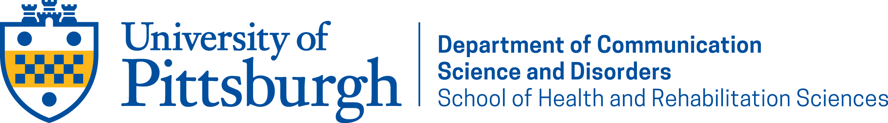

<figure>
	
</figure>

# Physiological Assessment

## Registration information
CSD 2045 1040-SEM (14617) Spring 2024  
**Time**:  Thu 05:30 -- 08:20 pm  
**Dates**: 01/08/2024 - 04/27/2024  
**Location**: 5047 Forbes Tower  
**Credits**: 3  

## Instructor
Hari M. Bharadwaj, Ph.D. 
Assistant Professor of Communication Science and Disorders  
Office: Forbes Tower 5063 
e-Mail: <hari.bharadwaj@pitt.edu> 
Office Hours: There will be one open hour for drop-in discussion via Zoom (time and Zoom link TBA). In addition, office hours are available by appointment (send me a message on Canvas or via e-mail). Also, see the "Discussion
Forum" section below. 

## Description
Acoustic and electrophysiological assays of the auditory system offer an objective, non-invasive window into the integrity and function of the ascending auditory pathway. This course will focus on the measurement, mechanisms of generation, interpretation, and clinical application of auditory evoked responses. Features of otoacoustic emissions (OAEs) and auditory brainstem responses (ABRs) across the continuum of normal hearing and diverse forms of hearing loss, and applications across the lifespan are emphasized. 

## Learning Outcomes
1. Describe normal aspects of auditory function relevant to the generation and interpretation of common physiological measures used in audiology.
2. Define terminology associated with, and describe the selection and measurement of different flavors of otoacoustic emissions and electrophysiological responses.
3. Identify and label features of OAEs and ABRs in normal hearing and make predictions for how they may be altered by different forms of hearing loss.
4. Interpret OAE and ABR data from test examples for hearing screening and threshold estimation.
5. Interpret OAE and ABR data from test examples for differential audiological diagnoses.

ASHA Certification 2020 Standards Knowledge and Skills Outcomes (Standard II) addressed by this course include:
|Code | Description|
|-----|------------|
|A5 | Calibration and use of instrumentation according to manufacturers’ specifications and accepted standards|
|A7 | Applications and limitations of specific audiologic assessments ~~and interventions~~ in the context of overall client/patient management |
|C10 | Evaluating basic audiologic findings and client/patient needs to determine differential diagnosis and additional procedures to be used |
|C11 | Selecting, performing, and interpreting physiologic and electrophysiologic test procedures, including electrocochleography, auditory brainstem response with frequency-specific air and bone conduction threshold testing, and click stimuli for neural diagnostic purposes |
|C12 | Selecting, performing, and interpreting otoacoustic emissions testing |

This course also addresses the following CAA standards:
|Standard | Description|
|-----|------------|
| 3.1.2A Foundations of Audiology Practice | Normal aspects of auditory ~~and vestibular~~ function across the lifespan |
| 3.1.2A Foundations of Audiology Practice | Effects of pathophysiology on the auditory ~~, vestibular, and related body~~ systems |
| 3.1.2A Foundations of Audiology Practice | Physical characteristics and measurement of simple and complex acoustic stimuli |
| 3.1.2A Foundations of Audiology Practice | Physical characteristics and measurement of non-acoustic stimuli (e.g., EEG, tactile, electrical signals) |
| 3.1.4A Assessment of the structure and function of the auditory and vestibular systems as well as the impact of any changes to such systems | Perform audiologic assessment using ~~behavioral~~, physiological (e.g., immittance, wideband reflectance, evoked potentials), ~~psychophysical, and self-assessment~~ tools |
| 3.1.4A Assessment of the structure and function of the auditory and vestibular systems as well as the impact of any changes to such systems | Interpret results of the evaluation to establish type and severity of disorder |

## Learning Resources, Technology, & Texts

### Canvas
Materials, assignments, and grades for the course will be
posted on [Canvas](https://canvas.pitt.edu/).
Canvas will serve as the starting point for all course material.
Materials may also be hosted elsewhere and links provided on Canvas.

### Textbooks
There are **no** required textbooks. Readings from primary literature, class notes/slides, and other handouts/resources will be posted on Canvas.

### Supplemental References
1. Dhar, S., & Hall III, J. W. (2018). Otoacoustic emissions: Principles, procedures, and protocols. Plural Publishing. ISBN: 978-1-94488-385-0.
2. Durrant, J. D., Fowler, C. G., Ferraro, J. A. (2020). Basic Concepts of Clinical Electrophysiology in Audiology. Plural Publishing. ISBN: 978-1-63550-175-9.
3. *Section II: Physiological principles and measures*, in Katz, J., Chasin, M., English, K. M., Hood, L. J., & Tillery, K. L. (Eds.). (2015). Handbook of clinical audiology (Vol. 7, pp. 61-75). Philadelphia, PA: Wolters Kluwer Health. ISBN: 978-1-45119-163-9.

### Required software
For several quizzes, we will utilize [Google Colaboratory](https://colab.research.google.com/) to manipulate, analyze, and interpret case/test examples of otoacoustic emissions and auditory brainstem response data. Google Colaboratory is a cloud-based platform equipped with pre-installed software libraries tailored for these analyses. Basic access to Colaboratory is complimentary with a Google account. You may use an existing Google account or create a new one at no cost, specifically for this course. Detailed instructions on how to access and utilize Colaboratory will be provided in class and in conjunction with relevant quizzes.

### Discussion Forum
We will use the group discussion board within Canvas
for Q&A and discussion. Rather than emails, using the discussion board is the
preferred method for asking questions outside class.
Using the discussion board allows for getting help
quickly and efficiently both from classmates, and the instructor. You are
encouraged to ask *and answer* questions about logistics, content,
quizzes, and case presentations.
However, please do *not* share explicit solutions to quizzes, etc.
You are also encouraged to share any ideas, articles, videos, or other resources related to 
the course (or audiology more broadly) that you think would be interesting and/or beneficial to others.

## Quizzes
Quizzes (six) will typically be made available a week before they are due.
Quizzes will probe your understanding of the concepts/content discussed in this course and integration of the ideas with ideas gained from clinical experience, readings of primary literature, and with lab exercises (done as part of the Clinical Procedures Lab course with Dr. Alscher). Quizzes will also involve hands-on exercises working through simulated and/or real case examples and applying knowledge from the course to analyze and interpret physiological measurement results. Quizzes may also involve watching video presentations by other professionals/scientists. Submitted work will consist of electronic responses or PDF file uploads via Canvas. All quizzes due by the time and date posted on Canvas. You are encouraged to discuss course topics with your peers and other colleagues, but discussions involving quizzes should be done *in broad/general terms*. Please do not share specific solutions.

There is a quota of **three total late days** you can use
throughout the semester to manage unanticipated pressing events that may
prevent you from submitting quizzes on time. Save and use them
judiciously. You can use all three days for one assignment or spread
them over (up to) three assignments.
Note however that part-day delays (e.g., late by 2 hours) will count as
1 whole day of quota being used up.
No submissions will be accepted, even if you have unused late days,
after April 27, 2024 (Friday of final exam week).
For any additional delays beyond the 3-day rule,
there is a 20% penalty per day applied to the corresponding quizzes.
Exceptions will only be made in unavoidable circumstances (e.g., extended
health[1](#fn1) issue) about which you discuss with the instructor as soon as
the situation permits, and make alternative arrangements.

<a name="fn1">[1]</a>: Mental health *is* health

## Clinical Case Presentation
Each student will orally summarize and present their analysis of a clinical case involving physiological assessment(s). Students are welcome to bring their own cases (check with instructor if the case is suitable), or present a case that is assigned to them by the instructor. The oral presentation (about 12--15 mins) should stimulate discussion of the issues pertinent to the case based on knowledge acquired during this course *and* from previous classes/clinical experience. Any broader takeaways that the case suggests should also be discussed.

## Tentative schedule

Each class will be broken into three sessions of about 50 mins each with two 10-minute breaks in between.

| Date   | Topic | Comments |
|--------|-------|----------|
| Jan 11 | Introduction; Systems view of outer and middle-ear function; Immittance and middle-ear muscle reflexes review ||
| Jan 18 | Systems view of active cochlear mechanics and introduction to OAEs ||
| Jan 25 | Spontaneous vs. evoked OAEs; Reflection and distortion sources of OAEs; Stimulus calibration and data acquisition principles for TEOAEs and DPOAEs  | Q1 due |
| Feb 01 | Normative features of TEOAEs and DPOAEs and relationship to cochlear active mechanisms ||
| Feb 08 | **Hari away -- DO REMOTE ACTIVITY**| Q2 due |
| Feb 15 | Systems view of ascending auditory pathway; Instrumentation and considerations for evoking and recording different flavors of auditory potentials ||
| Feb 22 | Normative features of the electrocochleogram (ECoG) and the ABR, relationship to cochlear active mechanisms, and predictions for conductive and sensory hearing loss | Q3 due|
| Feb 29 | Normative features of the ABR in relation to neural coding in the ascending pathway, and predictions for neurogenic hearing alterations ||
| Mar 07 | Clinical applications and case studies: Screening using OAEs and ABRs; Introduction to threshold estimation | Q4 due |
| Mar 15 | **Spring Break -- No Class** ||
| Mar 22 | Clinical applications and case studies: Ear- and cochlear-place-specific threshold estimation using ABRs ||
| Mar 29 | Clinical applications and case studies: Ototoxicity monitoring; Differential diagnosis beyond thresholds | Q5 due |
| Apr 04 | Clinical applications and case studies: Intraoperative monitoring; Review ||
| Apr 11 | Brief foray into other auditory evoked potentials, and vestibular myogenic potentials | Q6 due |
| Apr 17 | Student case presentations ||
| Apr 25 | Student case presentations ||

## Final Grade Composition and Grading Scale

In this class, grades will reflect the sum of each student's achievement throughout the semester.
Student will accumulate points as described below.

| Assessment Item | Weight |
|-----------------|--------|
| Class participation and contribution to peer learning | 7% |
| Quizzes (Q1 - Q6) | 78% |
| Case presentation | 15% |

The standard grading scale for our SLP and AuD programs will be used in this course.  
A+: 98 - 100  
A : 94 - 97  
A-: 90 - 93  
B+: 87 - 89  
B : 84 - 86  
B-: 80 - 83  
C+: 78 - 79  
C : 76 - 77  
C-: 70 - 75  
D+: 67 - 69  
D : 63 - 66  
D-: 60 - 62  
F : below 60

In order to meet the CFCC and CAA standards across all areas of skills/knowledge addressed in this course, you must score 60% or more in each quiz **and** maintain an *overall* grade level of C or higher (i.e., 76% or more). If you score below the criterion level in any of the individual assignments, you will be given the opportunity to remediate by resubmitting the assignments on Canvas. The deadlines for resubmission will be worked out by the instructor in discussion with individual students on a case-by-case basis. If your overall grade drops below a C, you may be required to retake the course.

## Attendance Policy
Face-to-face meeting in class is the primary modality of instruction and in-person attendance is
generally expected for all classes throughout the semester. However,
absence or remote attendance due to unavoidable reasons will be accommodated.
To facilitate this, lectures/seminars will also be available remotely via synchronous Zoom sessions,
and asynchronously via recorded video.
If you need to miss a class or attend remotely, please inform the instructor
in a timely manner (if the situation permits). In such cases,
it is your responsibility to catch up with
the material that you miss using the asynchronously available video
recordings. If extended absence and schedule adjustments are
necessitated by unavoidable circumstances, please contact the instructor
for working out alternative arrangements as soon as the situation permits. Note
that office hours and the discussion forum are available to assist you
as well.

## Academic Integrity
Students in this course will be expected to comply with the [University of Pittsburgh’s Policy on Academic Integrity](https://www.provost.pitt.edu/info/ai1.html). Any student suspected of violating this obligation for any reason during the semester will be required to participate in the procedural process, initiated at the instructor level, as outlined in the University Guidelines on Academic Integrity. This may include, but is not limited to, the confiscation of the examination of any individual suspected of violating University Policy. Furthermore, no student may bring any unauthorized materials to an exam, including dictionaries and programmable calculators.

To learn more about Academic Integrity, visit the [Academic Integrity Guide](http://pitt.libguides.com/academicintegrity/) for an overview of the topic. For hands-on practice, complete the [Understanding and Avoiding Plagiarism tutorial](http://pitt.libguides.com/academicintegrity/plagiarism).

### Use of Generative AI Tools in Academic Work [GPT-4 provided the outline for this section]
Students are allowed to use generative AI tools, such as GPT-based language models, as supplementary resources for this course. However, the use of these tools must adhere to the following guidelines to maintain academic integrity and scholarly values:

1. **Attribution**: Any direct outputs from a generative AI tool that are included in academic work must be clearly cited.

2. **Original Thought**: Generative AI should be used to augment rather than replace original thinking and scholarship. Your work should primarily reflect your own understanding and synthesis of the subject matter. Examples of acceptable uses of AI tools include idea generation, outlining, proofreading, and grammar checks. Examples of unacceptable use include whole-section generation, substituting AI-generated analyses for your own, and automated research. While there is no fixed ratio for AI-generated vs. student-generated content, a good rule of thumb is that the bulk (for instance >80-90%) of your written output should be your own work, both in content and in analysis, even when properly cited.

3. **Critical Evaluation**: Exercise critical judgment when using AI-generated content. Not all information produced by an AI tool will be accurate or valid in an academic context.

## Disability Services
If you have a disability for which you are or may be requesting an accommodation, you are encouraged to contact both your instructor and [Disability Resources and Services (DRS)](https://www.studentaffairs.pitt.edu/drs/), 140 William Pitt Union, (412) 648-7890, drsrecep@pitt.edu, (412) 228-5347 for P3 ASL users, as early as possible in the term. DRS will verify your disability and determine reasonable accommodations for this course.

## Copyright Notice
These materials may be protected by copyright. United States copyright law, 17 USC section 101, et seq., in addition to University policy and procedures, prohibit unauthorized duplication or retransmission of course materials.

See [Library of Congress Copyright Office](https://www.copyright.gov/) and the [University Copyright Policy](https://www.policy.pitt.edu/sites/default/files/Policies/Community-Standards/Policy_CS_03.pdf).

## Equity, Diversity, and Inclusion
The University of Pittsburgh does not tolerate any form of discrimination, harassment, or retaliation based on disability, race, color, religion, national origin, ancestry, genetic information, marital status, familial status, sex, age, sexual orientation, veteran status or gender identity or other factors as stated in the University’s Title IX policy. The University is committed to taking prompt action to end a hostile environment that interferes with the University’s mission. For more information about policies, procedures, and practices, visit the [Civil Rights & Title IX Compliance web page](https://www.diversity.pitt.edu/civil-rights-title-ix-compliance).

I ask that everyone in the class strive to help ensure that other members of this class can learn in a supportive and respectful environment. If there are instances of the aforementioned issues, please contact the Title IX Coordinator, by calling 412-648-7860, or e-mailing titleixcoordinator@pitt.edu. Reports can also be [filed online](https://www.diversity.pitt.edu/civil-rights-title-ix-compliance/make-report/report-form). You may also choose to report this to a faculty/staff member; they are required to communicate this to the University’s Office of Diversity and Inclusion. If you wish to maintain complete confidentiality, you may also contact the University Counseling Center (412-648-7930).
In addition, use the link below for information on the [University of Pittsburgh’s Mission and Vision for Equity, Diversity and Justice](https://www.diversity.pitt.edu/about/mission-and-vision) and updated listings of campus activities and resources. 

The Department of Communication Science and Disorders welcomes and values all people and their wide range of experiences, backgrounds and perspectives.  Access the SLP MA/MS and AuD degree programs’ [Academic Handbook](https://www.shrs.pitt.edu/sites/default/files/2022-2023%20SLP%20and%20AuD%20Academic%20Handbook_6.09.2022.pdf) and go to page 6  to review the CSD policy related to equity, justice and inclusion as it applies to educational interactions.  

## Health and Safety Statement
During this pandemic, it is extremely important that you abide by the [public health regulations](https://www.alleghenycounty.us/Health-Department/Resources/COVID-19/COVID-19.aspx), the University of Pittsburgh’s [health standards and guidelines](https://www.policy.pitt.edu/university-policies-and-procedures/covid-19-standards-and-guidelines), and [Pitt’s Health Rules](https://www.coronavirus.pitt.edu/healthy-community/pitts-health-rules). These rules have been developed to protect the health and safety of all of us.  

The University’s requirements for face coverings will at a minimum be consistent with [CDC guidance](https://www.cdc.gov/coronavirus/2019-ncov/science/community-levels.html) and masks are required indoors (campus buildings and shuttles) on campuses in which COVID-19 Community Levels are High. This means that when COVID-19 Community Levels are High, you must wear a face covering that properly covers your nose and mouth when you are in the classroom. If you do not comply, you will be asked to leave class. It is your responsibility to have the required face covering when entering a university building or classroom. Masks are encouraged, but optional indoors for campuses in which county levels are Medium or Low. Be aware of your [Community Level](https://www.cdc.gov/coronavirus/2019-ncov/science/community-levels.html) as it changes each Thursday. [Read answers to frequently asked questions regarding face coverings](https://www.coronavirus.pitt.edu/frequently-asked-questions-about-face-coverings). For the most up-to-date information and guidance, please visit [coronavirus.pitt.edu](https://coronavirus.pitt.edu) and check your Pitt email for updates before each class.

If you are required to isolate or quarantine, become sick, or are unable to come to class,
please inform me in a timely manner (if the situation permits).
In such cases, it is your responsibility to catch up with
the material that you miss using the asynchronously available video
recordings. If extended absence and schedule adjustments are
necessitated by unavoidable circumstances, please contact me
for working out alternative arrangements as soon as the situation permits.

## Gender Inclusive Language Statement
Language is gender-inclusive and non-sexist when we use words that affirm and respect how people describe, express, and experience their gender.  Gender-inclusive/non-sexist language acknowledges people of all genders (for example, first year student versus freshman, chair versus chairman, humankind versus mankind, everyone versus ladies and gentlemen, etc.).  It also affirms non-binary gender identifications, and recognizes both gender identity and expression.  Identities including trans, intersex, and genderqueer reflect personal descriptions, expressions, and experiences.  Just as sexist language excludes women’s experiences, gendered language excludes the experiences of individuals whose identifies may not fit the gender binary, and/or who may not identify with the sex they were assigned at birth.  Students, faculty, and staff have the right to control their own identity and to be referred to by the name and pronouns with which they identify.  People also have the right to maintain their privacy regarding information they do not wish to share about their identities, including gender identity and pronouns.

## Your Well-Being Matters
For general information about mental health, see the
[National Institute of Mental Health (NIMH)
website.](https://www.nimh.nih.gov/health/)

Graduate school can be an exciting and challenging time. It can be helpful to remember that we all benefit from assistance and guidance at times, and there are many resources available to support your well-being while you are at Pitt. You are encouraged to visit [Thrive@Pitt](https://www.thrive.pitt.edu/) to learn more about well-being and the many campus resources available to help you thrive. If you find yourself beginning to feel some stress, anxiety, and/or
feeling slightly overwhelmed, one option is to try
[TAO](http://www.studentaffairs.pitt.edu/cc/therapy-assistance-online/) (available for free with your
Pitt login, sign in to find information and tools at any time), or
other mobile apps such as [Calm](https://www.calm.com),
[Aura](https://www.aurahealth.io),
[Headspace](https://www.headspace.com), etc. 

If you or someone you know is in need of mental-health support, [services](https://www.studentaffairs.pitt.edu/cc/services/) are available through the [University Counseling Center (UCC)](https://www.studentaffairs.pitt.edu/cc/). The UCC can be contacted via phone at 412-648-7930, and is located on the 2nd Floor of Nordenberg Hall - Wellness Center at 119 University Place, Pittsburgh, PA 15260. The UCC website also provides links to a [range of resources](http://www.studentaffairs.pitt.edu/cc/resources/) and information about programs that may be beneficial. 

