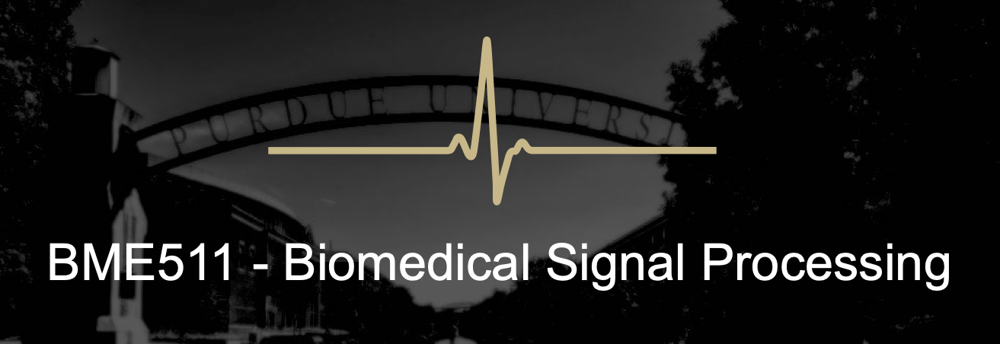

<figure>
	
</figure>

# Purdue University BME 51100 (Fall 2021)

```
Note: Some logistical details may change prior to the start of the Fall 2021
semester depending on the status of the COVID-19 pandemic, and software
licensing decisions within Purdue.
```

## Registration
Biomedical Signal Processing <br>
BME 51100 - MJD (in-person section), EPE, OXE, ONC <br>
**Time**:  TR 09:00 -- 10:15 am <br>
**Location**: MJIS 1001 (in-person), or remote (synchronous/asynchronous
options) <br>
**Credits**: 3 <br>
## Instructor
Hari M. Bharadwaj, Ph.D.
Assistant Professor of Biomedical Engineering <br>
Assistant Professor of Speech, Language, & Hearing Sciences <br>
Office: LYLE 3162 <br>
e-Mail: <hbharadwaj@purdue.edu><br>
Office Hours: TBA (1 hr/week via Zoom). Also see the "Discussion
Forum" section below.<br>
**TA**: Ravinderjit (Rav) Singh, e-Mail: <singh415@purdue.edu><br>
TA Office Hours: TBA


## Description 
This is a biomedical "data-science" course covering the
application of signal processing and stochastic methods to biomedical
signals and systems. A "hands-on" approach is taken throughout the
course (see section on required software). While an orientation to
biomedical data is key to this course, the tools and concepts covered
here will provide foundational skills that are useful in many domains.
Topics include: overview of biomedical signals; Fourier transforms
review and filter design, linear-algebraic view of filtering for
artifact removal and noise suppression (e.g., frequency filtering,
regression, noise-cancellation, PCA, ICA); statistical inference on
signals and images; estimation theory with application to inverse
imaging and system identification; spectra, spectrograms and wavelet
analyses; pattern classification and diagnostic decisions (machine
learning approaches and workflow).

This course is distinct from other classic offerings in ECE/MA/STAT in
at least three ways:

1.  Relevant theory in signal processing and statistical methods is
    covered as needed, but a major focus is on
    implementation/application of the fundamental techniques to
    real-world biomedical signals.

2.  Statistical methods that are typically taught with a "univariate"
    perspective are expanded to topologically organized high-dimensional
    data such as time-series and images, and done so motivated by the
    needs in biomedical applications (e.g., electrophysiology,
    neuroimaging).

3.  This course uses practical applications to integrate probabilistic
    methods with classic linear-algebraic tools (such as Fourier
    transforms). These foundational areas are often introduced in
    separate courses, but are powerful when brought together.


## Course Outcomes

1.  Understand practical problems in objective analyses of biomedical
    signals.

2.  Understand the theoretical background underlying the use of digital
    signal processing and statistical techniques for biomedical
    applications.

3.  Identify the best solution for specific problems by considering the
    benefits and limitations of various digital signal processing
    approaches.

4.  Implement appropriate signal processing algorithms for practical
    problems involving biomedical signals and systems.

5.  Propose, carry out, orally present, and write up in
    conference-proceedings format, a biomedical-research mini project
    using signal-processing.


## Learning Strategies
In-class lectures and discussions; Hand-solved
and computer-programmed problem sets; Research-oriented predefined
midterm project; Self-designed final research project

## Prerequisites
ECE 301 or equivalent (Signals and Systems), Introductory
probability/random process concepts (e.g., ECE 302, STAT 350 etc.),
Familiarity with Python
(Python will be the default language used in class, but if you strongly
prefer using MATLAB instead, that is an option too). If you have
questions about whether you have the requisite background, please feel
free to get in touch in advance, or within the first week of classes.


## Midterm Project (about 2--3 weeks)
A pre-defined midterm project will
apply signal processing to a brain-computer interface (BCI) dataset that
is based on the so-called "P300" response measured using
electroencephalography (EEG). Detailed instructions will be provided to
walk through the problem at hand and specify the deliverables. The
dataset comes from Hoffmann et al. (2008) and includes measurements both
from typical control individuals and individuals with limited muscle
control.

**Reference:** Hoffmann, U., Vesin, J. M., Ebrahimi, T., & Diserens,
K. (2008). An efficient P300-based brain--computer interface for
disabled subjects. Journal of Neuroscience methods, 167(1), 115-125.


## Final Project (final 4 weeks or so)
An independent project will apply
signal processing to a research question of interest to each student.
This project can either be related to ongoing research in a lab or can
replicate a published study. The final projects are intended to be
extensive as they will hopefully be in an area of direct interest and
familiarity to each student. Projects will be presented to the class
during the final two weeks of the semester (modeled after a ~10-min
conference talk) and will be written up in a final report (modeled after
a brief conference proceedings paper, ~2000 words + figures +
references). Grading is based on content, oral presentation, and written
presentation. Note: content is judged based on what you accomplish by
submission of your written report, i.e., you are welcome to keep working
after your oral presentation and include a more complete version in your
written report.


## Tentative Schedule
Although listed below in abstract terms,
all topics will be motivated and discussed through
representative biomedical examples.

  |Date | Topic | Notes|
  |-----|-------|------|
  | Aug 24, 26	|	Introduction; Orientation to Python; Fourier transform and general intuitions about different signal representations (linear-space view) | PS0 |
  |Aug 31, Sep 02  | Noise reduction (I) -- Triggered averaging; Filter design & trade-offs ||                                                                            
  |Sep 07, 09       | Noise reduction (II) -- Filtering beyond just frequencies using linear-space thinking, noise "cancellation" and regression         |                             PS1 due
  | Sep 14, 16       | Noise reduction (III) -- Multichannel filtering, PCA and applications ||                                                              
  | Sep 21, 23       | Statistical inference (I) -- Basics, ROC curves, multiple comparisons  | PS2 due|
  | Sep 28           | Statistical inference (II) -- Inference on 1D signals ||                                    
  | Sep 30           | Midterm project overview -- P300 brain-computer interface | PS3 due |
  | Oct 05, 07       | Statistical inference (III) -- Review, extension of methods from 1D to images||
  | Oct 12           | **October Break -- No Class**    ||     
  | Oct 14           | Spectral and time-frequency analysis (I) -- Auto/cross-correlation review; Spectrum estimation with preview of bias/variance tradeoff ||
  | Oct 19, 21       | Spectral and time-frequency analysis (II) -- Tapering and multitaper methods | Midterm project due|
  | Oct 26, 28       | Spectral and time-frequency analysis (III) -- Non-stationary signals and wavelets ||
  | Nov 02           | Modeling of biomedical signals and systems (I) -- Introduction to statistical estimation (ML), bias, and variance ||
  | Nov 04           | Modeling of biomedical signals and systems (II) -- Regularization (i.e., priors, MAP) and model selection ||
  | Nov 09         | Modeling of biomedical signals and systems (III) -- Minimum norm estimation and deconvolution example, Loess regression | PS4 due |
  | Nov 11, 16     | Spectral and time-frequency analysis (IV) -- Cross-spectrum, coherence, and phase locking | Final proposal due |
  | Nov 18, 23     | Machine learning approaches (I) -- ROC curve review; Linear classifiers and perceptron example; Support vector machines  ||                                       
  | Nov 25         |  **Thanksgiving -- No Class** ||
  | Nov 30, Dec 02 | Machine learning approaches (II) -- The "training &#8594; validation &#8594; testing" workflow and combating overfitting; unsupervised clustering ||
  | Dec 07         | Machine learning approaches (III) -- Worked examples; External resources on neural networks and deep learning | Multiple choice due |
  | Dec 09 | Review and consolidation with more examples ||
  | Dec 13--17      | Final project presentations during exam week (no exam) | Final report due|


## Final Grade Composition

  |Assessment Item |  Weight |
  |--------------- | --------|
  | Problem Sets ("PS" 1 -- 4) |                  35% |
  | Consolidated Multiple Choice Problem Set   |     12% |
  | Midterm brain-computer interface project   |     20% |
  | Final (individual) research project    
  | - Proposal                         |             5%|
  | - Oral presentation                |            10%|
  | - Content                          |            10%|
  | - Written presentation             |             8%|

Additional bonus points may be assigned for contributions to peer
success through the discussion forum.


## Supplemental References
No required textbooks. Class notes and code examples will
be provided for all topics in some combination of PDFs, web pages,
and Jupyter Notebooks.

The following optional additional resources are suggested for students
interested in exploring from the ground up on their own.

1.  Moon, T. K., & Stirling, W. C. (2005). Mathematical methods and
    algorithms for signal processing. Prentice hall.
    ISBN: 9788129709769.

2.  Hastie, T., Tibshirani, R., & Friedman, J. (2009). The Elements of
    Statistical Learning Data Mining, Inference, and Prediction (2nd
    Illustrated Edition). ISBN: 9780387848587. \[Reprint PDF may be
    available for download from [Trevor Hastie's web
    page](https://web.stanford.edu/~hastie/ElemStatLearn/)\].

3.  [Grant Sanderson's (3blue1brown) YouTube videos on
    Linear Algebra](https://www.youtube.com/playlist?list=PLZHQObOWTQDPD3MizzM2xVFitgF8hE_ab)
    provide excellent background on the geometrical thinking
    that we will exploit in this course.

4.  Poor, H. V. (1994). An Introduction to Signal Detection and Estimation.
    Springer-Verlag. ISBN: 9781441928375.


## Required Software

1.  Python >= 3.6 (or MATLAB if you strongly prefer)

2.  Any software to typeset PDF documents (e.g., Jupyter notebooks
    converted to PDF, or Microsoft (TM) Word
    &#8594; convert/print to PDF, or LaTeX)

3.  Software for final project presentations (e.g., Powerpoint,
    LaTeXBeamer, etc. converted to PDFs)


### Access to Python
As of this writing, Python is one of the most widely
used and fastest growing languages for data-science work. It is also
free for individual researchers and students. We will use Python >=
3.6 and associated scientific packages, namely NumPy, SciPy,
matplotlib, pandas, and scikit-learn in this course. It is the
responsibility of each student working with Python to find a reliable
computing environment in which to do the work for this course. This
should be worked out within the first week of class. There are two
excellent options that are recommended:

1.  **[Anaconda
    distribution](https://www.anaconda.com/products/individual)**: The
    Anaconda individual edition in free and can be easily installed on
    Mac, Linux, or Windows. This will run locally on the computer on
    which you install (e.g., personal computer, or lab computer). Being
    able to install and use these data-science tools is a minor but very
    useful skill in itself. Contained in the Anaconda distribution is
    Jupyter Notebook, which is an interactive coding environment that
    makes it easy to intersperse blocks of formatted text, code, and
    code outputs/figures.

2.  **[Google Colaboratory](https://colab.research.google.com/)**:
    Google Colaboratory is a cloud computing platform that comes
    pre-installed with all of the scientific libraries we will need in
    this course. A Google account is needed to access Colaboratory. Once
    logged in, users are presented with a Jupyter Notebook environment
    where you can start writing and running code right away. The code
    will run on virtual machines spawned from Google's servers. Data and
    notebooks can be saved on Google Drive (up to 5 GB is free as of
    this writing). If using this option, you could use your existing
    google account if you have enough space, or create a new one (for
    free) for this course.

The scientific libraries across MATLAB and Python have many
similarities. Thus, if you are primarily a MATLAB user, it is quite
feasible to use this course as an opportunity to try or switch to
Python. Excellent [online tutorials](http://www.scipy-lectures.org) are
available for scientific Python. Office hours and the forum discussions
are available to supplement your existing familiarity with Python.

If you are a MATLAB user looking to start using the Python data science
ecosystem, one useful resource is
[NumPy for MATLAB users](https://numpy.org/doc/stable/user/numpy-for-matlab-users.html).


### Access to MATLAB
Although we will use Python by default for
discussion in class, the scientific libraries are very similar across
MATLAB and Python. Code illustrated with one language is replicable in
the other. Thus, if you strongly prefer using MATLAB, that is an option
accommodated in this course. You are welcome to solve assignments and
projects using MATLAB code; the problems/projects themselves are
language-agnostic. It is the responsibility of each student choosing to
working with MATLAB to find a reliable computing environment in which to
do the work for this course. MATLAB should be available on all ITAP
machines on campus. As of this writing, all members of the Purdue
community should have access to the [latest version of MATLAB for free
via Purdue's campus-wide
license](https://www.mathworks.com/academia/tah-portal/purdue-university-31484706.html).
You could run MATLAB on the cloud using MATLABonline, similar to using
Python with Google Colaboratory. The [Purdue MATLAB
portal](https://www.mathworks.com/academia/tah-portal/purdue-university-31484706.html)
also provides links to many tutorials. Office hours and forum
discussions are available to supplement your existing familiarity with
MATLAB.


## Brightspace
Materials, assignments, and grades for the course will be
posted on [Brightspace](https://purdue.brightspace.com/). Although
Brightspace will serve as the starting point for all course material,
some material will be hosted elsewhere and links will be provided on
Brightspace. These include code blocks and Jupyter/IPython Notebooks on
[GitHub](https://github.com) and [Google
Colaboratory](https://colab.research.google.com/).

Also, online fora such as [Cross
Validated](https://stats.stackexchange.com), [Signal Processing Stack
Exchange](https://dsp.stackexchange.com), and others may already have
answers to many questions that typically come up. However, note that it
is possible for online resources to have erroneous information. Learning
to evaluate and use crowd-sourced online references is an important
skill in the modern-day data scientist's repertoire.

## Discussion Forum
Outside of class, we will use a discussion forum
(like Piazza) for Q&A and discussion. Rather than emails, this is the
preferred channel. Using a discussion forum allows for getting you help
fast and efficiently from classmates, and instructors. You are
encouraged to ask *and answer* questions about logistics, content,
assignments, and projects -- you can even do so anonymously. In
particular, requesting and sharing general and specific Python/MATLAB
"how to" knowledge is encouraged. However, please do *not* share
explicit code blocks or solutions to homework sets, projects etc. You
are also encouraged to share any ideas, articles, or videos that you
think would benefit others. Information about the specific discussion
platform to use will be posted on Brightspace prior to the start of Fall
2021.


## Problem Sets & Project Submissions
For PS1 -- 4 and the multiple choice problem set,
submitted work will consist of electronic files. All assignments are due
by the specified due date (and time). Electronic material will consist
of your \*.PDF file containing your solutions and figures. In some
cases, submission of code itself and/or data files (e.g., \*.mat data
files) <sup>[1](#fn1)</sup> may be requested. If multiple files are requested, all
electronic files should be bundled together as one ZIP archive before
submitting to Brightspace. Note that there is a problem set \#0 (PS0),
which is designed for reviewing MATLAB/Python use and is intended for
self appraisal and need not be submitted.

There is a quota of **three total late** days you can use
throughout the semester to manage unanticipated pressing events that may
prevent you from submitting assignments on time. Save and use them
judiciously. You can use all three days for one assignment or spread
them over (up to) three assignments. Note however that part-day delays
(e.g., late by 2 hours) will count as 1 whole day of quota being used
up. No submissions will be accepted, even if you have unused late days,
after Dec 17, 2021 (Friday of final exam week). Exceptions will be made
to the 3-day rule only in unavoidable circumstances (e.g., extended
health<sup>[2](#fn2)</sup> issue) about which you discuss with the instructor as soon as
the situation permits, and make alternate arrangements.

## Mental Health Statement
For general information about mental health, see the
[National Institute of Mental Health (NIMH)
website.](https://www.nimh.nih.gov/health/)

**If you find yourself beginning to feel some stress, anxiety, and/or
feeling slightly overwhelmed**, one option is to try
[WellTrack](https://purdue.welltrack.com/) (available for free with your
Purdue login, sign in to find information and tools at any time), or
other mobile apps such as [Calm](https://www.calm.com),
[Aura](https://www.aurahealth.io),
[Headspace](https://www.headspace.com), etc.

**If you need further information about other options and
resources**, please feel free to reach out to me (the instructor),
or your academic advisors. For support/more information, you could also
see the [Office of the Dean of Students](https://www.purdue.edu/odos/).
Hours: M -- F, 8 am -- 5 pm.

**If you find yourself struggling to find a healthy balance between
academics, social life, stress, etc.**, consider signing up for free
one-on-one virtual or in-person sessions with a [Purdue Wellness Coach
at
RecWell](https://www.purdue.edu/recwell/fitness-wellness/wellness/one-on-one-coaching/wellness-coaching.php).
Student coaches can help you navigate through barriers and challenges
toward your goals throughout the semester. Sign up is completely free
and can be done on BoilerConnect. If you have any questions, please
contact Purdue Wellness at <evans240@purdue.edu>.


**If you or someone you know is feeling overwhelmed, depressed, and/or
in need of mental health support**, services are available. Purdue
University is committed to advancing the mental health and well-being of
its students. For help and to speak with a clinician, contact Counseling
and Psychological Services (CAPS) at (765) 494-6995 or by going to CAPS'
office on the second floor of the Purdue University Student Health
Center (PUSH). For urgent situations after hours, on weekends and
holidays, call (765) 494-6995 to speak with a clinician. Please see the
[CAPS website](https://www.purdue.edu/caps/) for further information.


## "Protect Purdue" Classroom Guidance
The [Protect Purdue
Plan](https://protect.purdue.edu/plan/), which includes the [Protect
Purdue Pledge](https://protect.purdue.edu/pledge/), is campus policy and
as such all members of the Purdue community must comply with the
required health and safety guidelines. Required behaviors in this class
include: staying home and contacting the Protect Purdue Health Center
(496-INFO) if you feel ill or know you have been exposed to the virus,
properly [wearing a mask in classrooms and campus
building](https://protect.purdue.edu/updates/face-covering-protocols/),
at all times (e.g., mask covers nose and mouth, no eating/drinking in
the classroom), disinfecting desk/workspace prior to and after use,
maintaining appropriate social distancing with peers and instructors
(including when entering/exiting classrooms), refraining from moving
furniture, avoiding shared use of personal items, maintaining robust
hygiene (e.g., hand washing, disposal of tissues) prior to, during and
after class, and following all safety directions from the instructor.

Students who are not engaging in these behaviors (e.g., wearing a mask)
will be offered the opportunity to comply. If non-compliance continues,
possible results include instructors asking the student to leave class
and instructors dismissing the whole class. Students who do not comply
with the required health behaviors are violating the University Code of
Conduct and will be reported to the Dean of Students Office with
sanctions ranging from educational requirements to dismissal from the
university.

Any student who has substantial reason to believe that another person
in a campus room (e.g., classroom) is threatening the safety of others
by not complying (e.g., not wearing a mask) may leave the room without
consequence. The student is encouraged to report the behavior to and
discuss next steps with their instructor. Students also have the option
of reporting the behavior to the [Office of the Student Rights and
Responsibilities](https://www.purdue.edu/odos/osrr/). See also Purdue
University [Bill of Student
Rights](https://catalog.purdue.edu/content.php?catoid=7&navoid=2852#purdue-university-bill-of-student-rights).


## Emergency Preparedness
In the event of a major campus emergency, course
requirements, deadlines and grading percentages are subject to changes
that may be necessitated by a revised semester calendar or other
circumstances beyond the instructor's control. Relevant changes to this
course will be posted onto the course website or can be obtained by
contacting the instructor via email. You are expected to read your
\@purdue.edu email on a frequent basis.

## Academic integrity
See
https://www.purdue.edu/odos/academic-integrity/ -- *"Purdue University
values intellectual integrity and the highest standards of academic
conduct. To be prepared to meet societal needs as leaders and role
models, students must be educated in an ethical learning environment
that promotes a high standard of honor in scholastic work. Academic
dishonesty undermines institutional integrity and threatens the academic
fabric of Purdue University. Dishonesty is not an acceptable avenue to
success. It diminishes the quality of a Purdue education, which is
valued because of Purdue's high academic standards. Fostering an
appreciation for academic standards and values is a shared
responsibility among students, faculty, and staff. The information [on
this website](https://www.purdue.edu/odos/academic-integrity/) is
directed to students to define academic dishonesty and how to avoid
it."*.

Furthermore, the Purdue Honor Pledge Task Force, a student
organization responsible for stewarding the mission of the Honor Pledge
and encouraging a culture of academic integrity has fashioned the
following pledge: *"As a Boilermaker pursuing academic excellence, I
pledge to be honest and true in all that I do. Accountable together --
We are Purdue."*


## Nondiscrimination Statement
Purdue University is committed to maintaining a community
which recognizes and values the inherent worth and dignity of every
person; fosters tolerance, sensitivity, understanding, and mutual
respect among its members; and encourages each individual to strive to
reach his or her own potential. In pursuit of its goal of academic
excellence, the University seeks to develop and nurture diversity. The
University believes that diversity among its many members strengthens
the institution, stimulates creativity, promotes the exchange of ideas,
and enriches campus life. Purdue's nondiscrimination policy [can be
found here](https://www.purdue.edu/purdue/ea_eou_statement.php).


## Attendance Policy
Lectures will offered via face-to-face meeting in
class, synchronously via livestream (access details TBA), and
asynchronously via recorded video (uploaded to Brightspace within
$\sim$24 hours after each lecture). If registered for the in-person
section, attendance is generally expected, but will **not** be a factor
in the final grade. Students should stay home and contact the
[Protect Purdue Health Center](https://protect.purdue.edu) if they feel
ill, have any symptoms associated with COVID-19, or suspect they may
have been exposed to the virus. If you need to be absent for any
unavoidable reasons, please inform the instructor in a timely manner,
when possible. In such cases, it is your responsibility to catch up with
the material that you miss using the asynchronously available video
recordings. If extended absence and schedule adjustments are
necessitated by unavoidable circumstances, please contact the instructor
for making alternate arrangements as soon as the situation permits. Note
that office hours and the discussion forum are available to assist you
as well.

## If you become Quarantined/Isolated 
If you become quarantined or isolated at any
point in time during the semester, in addition to support from the
[Protect Purdue Health Center](https://protect.purdue.edu), you will
also have access to an Academic Case Manager who can provide you
academic support during this time. Your Academic Case Manager can be
reached at <acmq@purdue.edu> and will provide you with general
guidelines/resources around communicating with your instructors, be
available for academic support, and offer suggestions for how to be
successful when learning remotely. Importantly, if you find yourself too
sick to progress in the course, notify your academic case manager and
notify me via email. We will make arrangements based on your particular
situation. The Office of the Dean of Students (odos\@purdue.edu) is also
available to support you should this situation occur.

## Students with disabilities
Purdue University strives to make learning experiences
as accessible as possible. If you anticipate or experience physical or
academic barriers based on disability, you are welcome to let me know so
that we can discuss options. You are also encouraged to contact the
Disability Resource Center at: <drc@purdue.edu> or by phone:
765-494-1247.

## Course Evaluation
During the last two weeks of the course, you will
be provided with an opportunity to evaluate this course and your
instructor. Purdue uses an online course evaluation system. You will
receive an official email from evaluation administrators with a link to
the online evaluation site. You will have up to two weeks to complete
this evaluation. Your participation is an integral part of this course,
and your feedback is vital to improving education at Purdue University.


<a name="fn1">[1]</a>: Note that .mat is MATLAB's extension for HDF5 format files. It is
    also a recognized format with Python via the `scipy.io` module

<a name="fn2">[2]</a>: Mental health *is* health
